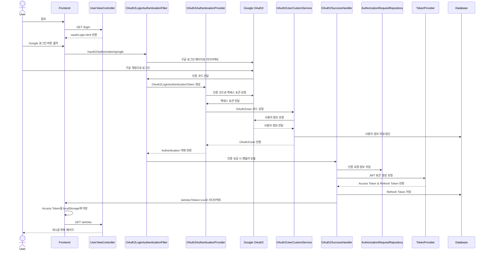
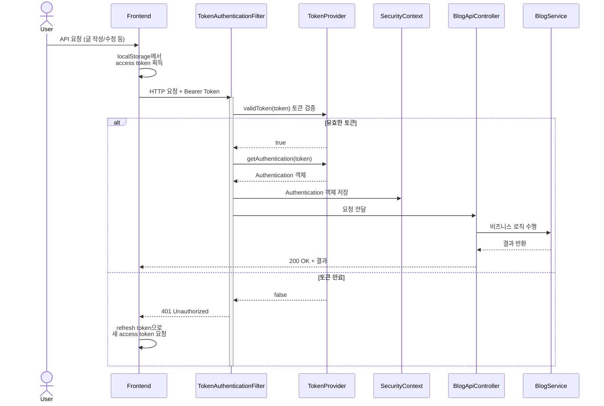

## 최초 OAuth2 로그인 흐름



### 1. 초기 접근 및 OAuth2 인증 요청

1. 사용자가 `/login` 엔드포인트 접근
2. `UserViewController`가 OAuth2 로그인 페이지(`oauthLogin.html`) 반환
3. 사용자가 Google 로그인 버튼 클릭 시 `/oauth2/authorization/google` 엔드포인트로 리다이렉트
4. Spring Security의 `OAuth2LoginAuthenticationFilter`가 요청을 가로채서 Google 로그인 페이지로 리다이렉트

### 2. OAuth2 인증 처리

1. 사용자가 Google 계정으로 로그인
2. Google이 인증 코드를 전달
3. `OAuth2LoginAuthenticationFilter`가 인증 코드로 `OAuth2LoginAuthenticationToken` 생성
4. `OAuth2AuthenticationProvider`가 인증 코드를 Google OAuth2 서버에 전달하여 액세스 토큰 요청
5. 받은 액세스 토큰으로 사용자 정보 요청

### 3. 사용자 정보 처리

1. `OAuth2UserCustomService`가 Google에서 받은 사용자 정보(이메일, 이름 등)를 처리
2. 기존 사용자가 있다면 정보 업데이트, 없다면 새로 생성하여 DB에 저장
3. 처리된 사용자 정보를 `OAuth2User` 객체로 반환
4. `Provider`가 최종 `Authentication` 객체 생성

### 4. 인증 성공 처리

1. 인증 성공 시 `OAuth2SuccessHandler` 호출
2. 인증 요청 정보를 쿠키에 저장 (`OAuth2AuthorizationRequestBasedOnCookieRepository`)
3. `TokenProvider`를 통해 JWT 액세스 토큰과 리프레시 토큰 생성
4. 리프레시 토큰은 DB에 저장하고 쿠키에도 설정
5. 액세스 토큰을 URL 파라미터에 포함시켜 `/articles?token=xxx`로 리다이렉트

### 5. 클라이언트 최종 처리

1. 클라이언트의 `token.js`가 URL에서 액세스 토큰을 추출하여 localStorage에 저장
2. `/articles` 엔드포인트로 이동하여 게시글 목록 페이지 표시

---

## 로그인 이후 JWT 인증 흐름




1. API 요청 시작:
    - 사용자가 보호된 리소스(예: 글 작성)에 접근 시도
    - Frontend가 localStorage에서 access token을 가져옴
    - 요청 헤더에 `Authorization: Bearer {token}` 추가

2. TokenAuthenticationFilter 처리:
   ```java
   doFilterInternal(request, response, filterChain) {
       String token = getAccessToken(request.getHeader("Authorization"));
       if (tokenProvider.validToken(token)) {
           Authentication auth = tokenProvider.getAuthentication(token);
           SecurityContextHolder.getContext().setAuthentication(auth);
       }
   }
   ```

3. 토큰 검증 및 인증:
    - TokenProvider가 JWT 토큰의 유효성 검증
    - 유효한 경우 Authentication 객체 생성
    - SecurityContext에 Authentication 저장

4. API 요청 처리:
    - 인증된 요청이 컨트롤러로 전달
    - 비즈니스 로직 수행 후 결과 반환

5. 토큰 만료 시:
    - 401 Unauthorized 응답
    - Frontend가 refresh token으로 새 access token 요청
    - 새 토큰으로 원래 요청 재시도

이는 세션-쿠키 방식과 달리 JWT를 사용하여 무상태(Stateless) 인증을 구현한 것입니다. 각 요청마다 토큰이 검증되며, 서버에 세션을 유지하지 않습니다.